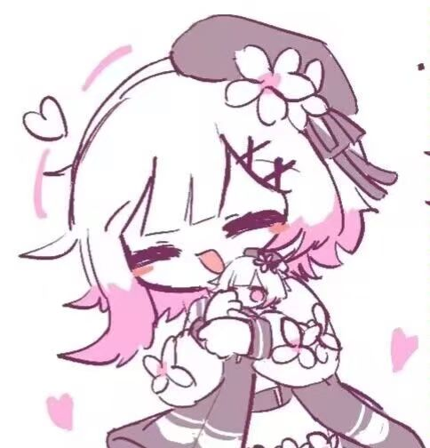

<div align="center">

# 🐱 Cat Desktop ─ 桌面收纳盒



**一个轻量、美观的 Windows 桌面快捷方式收纳工具**

[](https://dotnet.microsoft.com/)
[](https://learn.microsoft.com/wpf/)
[](LICENSE)
[](https://github.com/flhcx/Cat-Desktop/releases)

</div>

---

## ✨ 功能特点

| 功能 | 说明 |
|------|------|
| 🎯 **悬浮球** | 可爱的猫娘图标悬浮球，点击展开/折叠收纳面板，按住拖拽移动窗口 |
| 📦 **快捷方式管理** | 支持拖拽 `.lnk`、`.exe` 文件到面板中统一管理 |
| 🚀 **一键启动** | 左键单击图标即可启动对应程序，自动处理管理员权限 |
| 🖱️ **自由拖拽** | 窗口全区域可拖拽移动，自动限制屏幕边界防止丢失 |
| ⚙️ **设置面板** | 内置设置页：记住位置、开机自启、自定义悬浮球图片 |
| 🎨 **自定义图片** | 支持替换悬浮球图标为任意图片，一键重置恢复默认 |
| 🔍 **属性查看** | 右键快捷方式可查看详细属性（目标路径、参数等） |
| 📂 **打开位置** | 右键快捷方式可直接在资源管理器中定位目标文件 |
| 🔄 **开机自启** | 设置面板中可配置开机自启动（注册表方式） |
| 💾 **持久保存** | 自动保存快捷方式列表、窗口位置和所有设置 |
| 🎨 **精美 UI** | 无边框透明窗口、毛玻璃效果、丝滑展开/折叠动画 |

## 📥 快速开始

### 方法一：直接下载（推荐）

1. 前往 [Releases](https://github.com/flhcx/Cat-Desktop/releases) 页面
2. 下载最新版本的 `DesktopOrganizer.exe`
3. 双击运行即可，无需安装任何依赖

### 方法二：源码构建

```bash
# 克隆仓库
git clone https://github.com/flhcx/Cat-Desktop.git
cd Cat-Desktop

# 构建运行
dotnet run

# 发布独立 exe（含压缩，约 68MB）
dotnet publish -c Release -r win-x64 --self-contained true \
  -p:PublishSingleFile=true \
  -p:EnableCompressionInSingleFile=true \
  -p:IncludeNativeLibrariesForSelfExtract=true \
  -p:DebugType=none -p:DebugSymbols=false \
  -o ./publish
```

**构建要求**：[.NET 7 SDK](https://dotnet.microsoft.com/download/dotnet/7.0)

## 🎮 使用说明

| 操作 | 效果 |
|------|------|
| **左键点击**悬浮球 | 展开 / 折叠收纳面板 |
| **按住拖拽**悬浮球 | 移动整个窗口（不会超出屏幕） |
| **拖拽文件**到面板底部区域 | 添加快捷方式 |
| **左键点击**快捷方式图标 | 启动对应程序 |
| **右键**快捷方式图标 | 查看属性 / 打开位置 / 移除 |
| **点击 ⚙ 齿轮**按钮 | 打开设置面板 |

### ⚙️ 设置项

| 设置 | 说明 |
|------|------|
| 📍 记住窗口位置 | 下次启动时恢复上次退出的位置（默认开启） |
| 🚀 开机自启 | 系统启动时自动运行收纳盒 |
| 🎨 悬浮球图片 | 替换为自定义图片，或重置为默认猫娘图标 |

## 🏗️ 项目结构

```
Cat-Desktop/
├── App.xaml / App.xaml.cs        # 应用入口与全局资源
├── MainWindow.xaml               # 主窗口 UI 布局（含设置面板）
├── MainWindow.xaml.cs            # 交互逻辑（拖拽、动画、设置等）
├── Models/
│   └── ShortcutItem.cs           # 数据模型（快捷方式 & 配置）
├── Services/
│   ├── ShortcutResolver.cs       # 快捷方式解析 & 图标提取
│   └── DataService.cs            # JSON 配置持久化
├── Assets/
│   └── app.ico                   # 应用图标
├── tubiao.jpg                    # 默认悬浮球图标
└── DesktopOrganizer.csproj       # 项目配置
```

## ⚙️ 技术栈

- **框架**：WPF (.NET 7)
- **快捷方式解析**：IShellLinkW COM 互操作
- **图标提取**：System.Drawing.Common
- **数据存储**：System.Text.Json (`config.json`)
- **开机自启**：注册表 `HKCU\Software\Microsoft\Windows\CurrentVersion\Run`
- **发布优化**：单文件 + 压缩（`EnableCompressionInSingleFile`）

## 📋 更新日志

### v0.25
- ✨ 新增设置面板（⚙齿轮按钮切换）
- 📍 新增记住窗口位置开关
- 🎨 新增自定义悬浮球图片替换/重置
- 🔒 修复拖拽超出屏幕边界的问题
- 🪟 折叠时窗口缩小到悬浮球大小，不再有隐形拖拽区域
- 📐 窗口不再强制置顶，可被其他应用覆盖

## 📄 开源协议

本项目基于 [MIT License](LICENSE) 开源。

---

<div align="center">

**Made with ❤️ by [flhcx](https://github.com/flhcx)**

</div>
